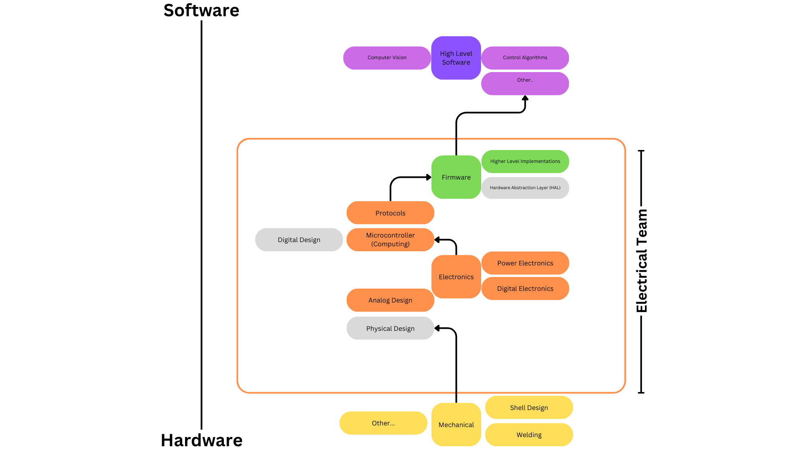
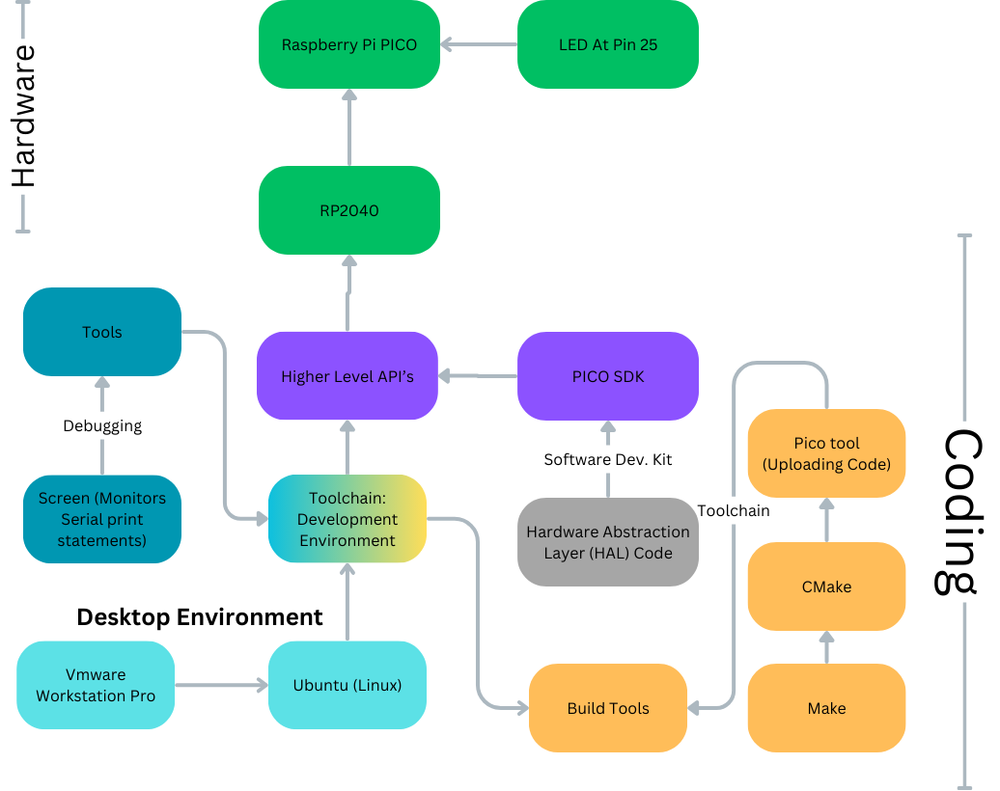
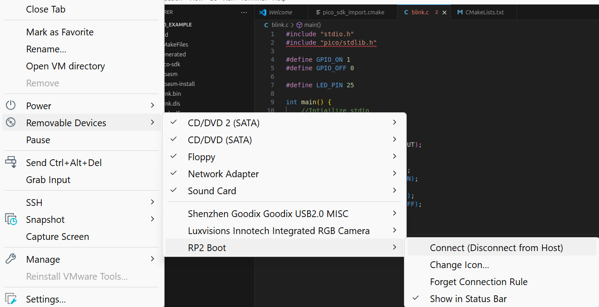
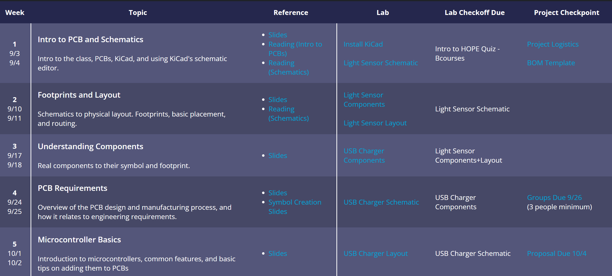
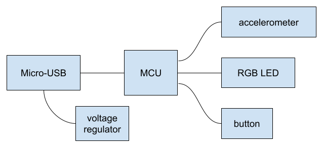

# Underwater Robotics @ Berkeley | Electrical Training

Hello there! Welcome to UR@B electrical team! UR@B Electrical training will introduce you to basic circuit concepts, and firmware. Additionally, the HOPE Decal content created by IEEE @ Berkeley will introduce you to printed circuit board CAD tools. 

> "*Note: Feel free too ask/wait for a electrical team member to help you when working on this training to prevent frustration.*"

> "*Note: If you already feel comfortable with all the concepts below, feel free to skip this whole training all together and work on the project*"

### Prerequisites:
- None

At the end of the training, you will know: 

1. Basic Circuit (Electronic) Concepts
2. Basic Firmware
3. Basic Printed Circuit Board Design (PCB) CAD Tools 

### High Level View:
<p align="center">
    
</p>
In the electrical team, you will be creating the electronics and the associated software to make it work. 

<br>

**Technologies Used:** C, RP2040, Raspberry Pi Pico, pico-sdk, VMWare Workstation Pro, Linux (Ubuntu), etc...

> "*Note: For each part, click on the dropdown to show the content.*"


# Prelab: Electronics (Hardware) - Part 1

You will learn about the concept of ground, voltage, current and various machine tools used in electrical engineering. 

<details>
<summary>Electronics Dropdown</summary>

## Current
Current is the rate at which electrons (particles) flow. Remember that particles are physical in nature. 

## Voltage 
Particles will stay still unless there is enough pressure to get them moving. Voltage is the difference in electric potential energy between two points. 
It is the **"Push"** that gives pressure to push electrons (particles) through a circuit. 

## Reference Voltage (Ground) 
<p align="center">
    
</p>
Reference voltage commonly referred to as **ground** is a value that can be used with respect to everything else. 
One example is that "Earth ground" can be used as the reference voltage but most times the reference voltage is relative to the application. 

</br>

**"Common" ground** is the reference voltage that is shared across
the whole application. 

> **V_GND = 0 V**

Most times, zero volts are used as the reference voltage to make calculations easier.  

Note that the reference voltage may not necessarily be 0 volts, It can be any value as long as the circuit designer is consistent. 

## Resistance
Resistance is the opposition to the flow of current. Everything has resistance including wires itself. 

## Ohm Law
<p align="center">
    
</p>
Image Credits: Build-electronics-circuit / Oyvind Nydal Dahl

</br>

Bringing it all together with Ohm's Law.  

> Voltage = Current * Resistance
 
> Current = Voltage / Resistance

> Resistance = Voltage / Current 

## Hardware Equipment
> Note: Please ask if you are interested in getting hands on experience with these machines.

### Power Supply Unit
Power supply unit provide a voltage source. 

### Multimeter
Measures Voltage, Current, and Resistance.

### Oscilloscope
Mainly used for tracking "signals". Signals are just voltage values. Oscilloscope is a multimeter but is able to provide a graph of the signal over time. 

</details>

> Checkpoint: No Checkpoint for Part 1

# Datasheet - Part 2 
When you are making anything, you are often not creating everything from scratch. You will need to use technical manuals, reference sheets, datasheets to know various features of "devices" that you plan on using in a design.

For example, consider a LED. 

There is a voltage value that the LED must be used to get the LED to turn on. This voltage value is called the "forward voltage". 
Consider: https://learn.adafruit.com/all-about-leds/the-led-datasheet
If you look at the datasheet, you will find that the "forward voltage" is 1.85V. That means the voltage difference across the LED should be that voltage value.

Note: Classes, Search engines, and books are your best friend in figuring out what various attributes you need to know when designing. 

Naturally, you are effectively required to search for information on your own because no one knows the exact information that is required.

Additionally, to make the LED work, you need to add a resistor. The point of the resistor is to limit the current. `R = 150Ohm - 300 Ohm` will work. The resistance depends on how intense the LED you want and minimum LED values.

### Lab: An Application-LED (Optional)
> Note: Please ask if you are interested in doing the LED application. It is a simple lab that walks you through how to get a LED to work.

> Checkpoint: No Checkpoint for Part 2

# Firmware (Software) and Toolchain Overview - Part 3
> "*Note: Feel free too ask/wait for a electrical team member to help you when working on this to prevent frustration.*"

> Note: You will need access to a RP2040 microcontroller with a LED.

<p align="center">
    
</p>

With the **RP2040** microcontroller which is part of the Raspberry Pi brand. 

<details>
<summary>Firmware (Software) Dropdown</summary>
    
> Prerequisites: These topics can be learned on the "job".

#### Git/Github
If you need help setting up Git/Github, use a search engine and search for "CS 61B Lab01: Setup" Lab. 

#### Command Line
If you need help with command related issues, please search for answers online. 

#### Understanding C 
If you need help with C language, please refer to https://inst.eecs.berkeley.edu/~cs61c/sp21/resources-pdfs/garcia_c_reference_slides.pdf 

#### Understanding CMake/Make - Build tools
If you need help with understanding CMake/Make then please search for the answers online. CMake/Make are just build tools. Instead of manually typing alot of commands, Make is able to "build" the code to a binary (.elf) file for you to use. CMake creates the "Make" file. 

## Development Environment Setup
Setting up Ubuntu with VMWare Workstation Virtual Desktop 

1.  Download VMWare Workstation Pro or VMWare Fusion Pro for MAC from broadcom.com, you can also use other virtualization software like VirtualBox 
2.  Download Ubuntu24.04 LTS ISO
3.  Add the Ubuntu to VMWare
4. Command Line: 
    In the Ubuntu Create 2 folders somewhere:
    - “development”, “program_files”
        - Do this by opening command line and going to the root directory. ~/
        - run `“mkdir development”`
            - It will be used to do any development
        - run `“mkdir program_files”`
            - Stores program files that you will see below such as picotool and pico-sdk
6. There are two ways to install programs. Using a package manager or downloading the program directly and then installing.
  - Note: Normally in other OS, you can double click files and a installer pops up, but in linux, you need to use `"sudo apt install ./<filename>.deb` 
  - Recommendation: Use one Package Manager. Ubuntu has “Snap” and “APT” . I recommend using “APT” and staying consistent.
7. Some Notes: Adding Environment Variables
    - Used when Building and compiling projects so programs know where files are
        - vim ~/.basrhc
        - Add by using EXPORT VAR_NAME=”/path”
8. Download VSCode by Googling “VScode Ubuntu” and downloading the .deb file
    - Open a terminal and goto the “Downloads folder” then run `“sudo apt install ./<filename>.deb”`
    - You can now run `“code .”` in directories in the terminal to open VSCode for a directory.
    - Other method of installing: `sudo snap install code --classic`
    - In terminal, run: `code --install-extension ms-vscode.cmake-tools`
    - In terminal, run: `code --install-extension ms-vscode.cpptools`
9. Download “Github CLI”. “gh” in the APT package manager
    - run `“gh auth login”` and login to github.
10. Packages Needed: sudo apt install gh git curl screen

Some Command Line Commands: https://www.git-tower.com/blog/command-line-cheat-sheet/

## Setting up Raspberry Pi Development:**
> Source/Reference: Many of the instructions and command was adapted from [lf-lang.org ](https://www.lf-lang.org/embedded-lab/GettingStarted.html)

1. Packages Needed: `sudo apt install gh git curl screen`

### Installing PICO-SDK
1. In the program_files directory, clone https://github.com/raspberrypi/pico-sdk. `gh repo clone raspberrypi/pico-sdk` command. 
2. Packages Needed: `sudo apt install cmake gcc-arm-none-eabi libnewlib-arm-none-eabi libstdc++-arm-none-eabi-newlib`
3. `cd` to the program_files/pico-sdk and run `git submodule update --init`
4. Set the PICO_SDK_PATH
   1. 
      1. run `export PICO_SDK_PATH=`pwd`
      2. run `echo "export PICO_SDK_PATH=$PICO_SDK_PATH" >> ~/.profile`
   2. Alternative Method: 
      1. In terminal: `vim ~/.bashrc`
      2. Use `pwd` to figure out what the absolute path to the pico-sdk
      3. Add `EXPORT PICO_SDK_PATH=”/home/<ubuntuname>/program_files/pico-sdk"` to the end of the file.
   
### Installing PICO-TOOL
1. Follow: [Reference](https://www.lf-lang.org/embedded-lab/Non-Nix.html#install-picotool)
1. In the program_files directory, clone https://github.com/raspberrypi/picotool. `gh repo clone raspberrypi/picotool` command. 
2. Packages Needed: `sudo apt install build-essential pkg-config libusb-1.0-0-dev cmake`
3. Make sure you have run `"git submodule update --init"` in the PICO-SDK.
4. Go through the process of running the commands in program_files

### RP Other
1.  To allow RP2040 via USB without superuser priviledges 
> `curl -s https://raw.githubusercontent.com/raspberrypi/picotool/master/udev/99-picotool.rules | sudo tee -a /etc/udev/rules.d/99-picotool.rules >/dev/null`. See: [more info.](https://www.lf-lang.org/embedded-lab/Prerequisites.html#using-picotool-on-linuxwsl)


## Creating your first RP2040 Project
1. Goto the `development` directory. If you are in `/program_files`, then run `cd ../development` 
2. Clone the training repo that belongs to you. 
   1. Goto `https://github.com/berkeleyauv/electrical_training` and find the "fork" button which is close to the `green <> Code` button. 
   2. Clone the training repo.
3. Login and authenticate yourself by doing `gh auth login` 
4. Create your own branch `first/lastname` and run `git checkout first/lastname` 
   1. Disclaimer: Permissions issues may be created due too `berkeleyauv/electrical-training` being protected so you may not be able to 'push'. Please let us now if this happens.  
5.  Note: When you want to `"save"`, run `git add .` then `git commit -m "whatever message you want"` and run `git push origin <your own branch or just main>`
    1. If you have forked, then push to "main"
    2. If you have created a branch, then push to the "branch"
    3. Check what remote options you have by running `git remote -v` . It may not be "origin"
       1. If you don't have origin, run `git remote add origin https://github.com/linktorepo`
6. All the setup has been done. Now, create a new folder and label it `rp2040_blink`. `cd` to the electrical-training repo and run `mkdir rp2040_blink`
7. If you haven't already. open vscode to the directory by running `code .`
8. `cd` into `rp2040_blink` in terminal. 
9. create a `pico_sdk_import.cmake` file
   1.  Goto `<PICO_SDK_PATH>/external/pico_sdk_import.cmake` file using another terminal or vscode. 
   2.  Copy and paste the file contents to `pico_sdk_import.cmake` that you have just created
   ```
        This is a copy of <PICO_SDK_PATH>/external/pico_sdk_import.cmake
        ...Get a copy from the file above.
    ```

10. Create `blink.c` file. 
    ```#include "stdio.h"

        #include "pico/stdlib.h"

        #define GPIO_ON 1

        #define GPIO_OFF 0

        #define LED_PIN 25

        int main() {
            //Intiailize stdio
            stdio_init_all();

            gpio_init(LED_PIN);
            gpio_set_dir(LED_PIN, GPIO_OUT);

            while(true) {
                printf("Blinking On!\n");
                gpio_put(LED_PIN, GPIO_ON);
                sleep_ms(2000);
                printf("Blinking Off!\n");
                gpio_put(LED_PIN, GPIO_OFF);
                sleep_ms(2000);
            }

        } ```
11. Create `CMakeLists.txt`
    ```
        #Source: https://www.youtube.com/watch?v=JhajoAyP8e4
        cmake_minimum_required(VERSION 3.12)

        # PULL in PICO SDK 
        include(pico_sdk_import.cmake)

        project(blink C CXX ASM)
        set(CMAKE_C_STANDARD 11)
        set(CMAKE_CXX_STANDARD 17)

        set(PICO_EXAMPLES_PATH ${PROJECT_SOURCE_DIR})

        #Using picotool
        set(picotool_DIR $MY_INSTALL_DIR/picotool)

        #Initializing the SDK
        pico_sdk_init()

        add_executable(blink blink.c)

        # Pull in our pico_stdlib which pulls in common libraries
        target_link_libraries(blink pico_stdlib)

        # Create map/bin/hex file etc.
        pico_enable_stdio_usb(blink 1)
        pico_enable_stdio_uart(blink 0)

        pico_add_extra_outputs(blink)
    ```

12. Create a `build` directory in the blink RP2040 Project directory. run `mkdir build`
13. cd into `build`
14. run `cmake ..`
15. run `make`
16. You will now see "blink.elf" in the folder. 
17. Connecting USB to the RP2040 MCU 
    1. Put the Raspberry Pi PICO into BootMode
       1.  Disconnect the USB
       2. Hold the Button and put the USB back in while simultaneously holding the button.
       3. If you are using VMWare Workstation, make sure that the RP2040 is connected to the virtual machine instead of your host computer.
       4. If it isn’t, right click the virtual machine at the side panel and goto “Removeable” Devices. then select RP2 Boot and Connect
<p align="center">
    
</p>

1.  Run `picotool load -x blink.elf`

2.  Congratulations! The LED should be blinking.

For more examples, see: https://github.com/raspberrypi/pico-examples.git

## Debugging: Monitor (Optional)

### Serial Monitor Debugging
1. At this point, you have the necessary toolchain to make any rp2040 project work.
2. To debug, often times you want to see print statements to know what your project is doing.
3. Follow: https://www.lf-lang.org/embedded-lab/Tools.html#finding-the-device-on-linux
4. Install "Screen"
5. Use `ls /dev/ttyACM*` to find the `PORT` that has the serial monitor.
6. Ensure these attributes exist in the corresponding files
    ```
    blink.c:main(..)
    //Add to the start of the main
    stdio_init_all(); 

    CMAKELists.c: 
    pico_enable_stdio_usb(blink 1)
    pico_enable_stdio_uart(blink 0)
    ```
7. Run `sudo screen <device> 115200`


### SWD Debugging
N/A

### JTAG Debugging
N/A

</details>

> Checkpoint: Blinking LED and showing the Serial Monitor

# PCB ECAD Tools - KICAD - Part 4

Instead of using prototyping boards like stripboards and breadboards, you will now create a "PCB" which makes your electronics much more versatile. Instead of wires failing off, the wires can't fall off printed circuit boards. Like how 3D Printing design uses CAD tools like Solidworks, electrical engineers use electronic computer aided design (ECAD) like KiCad. 

<details>
<summary>PCB ECAD Tools Dropdown</summary>

To get used to the KiCad ECAD software, please follow the HOPE course. 
#### Hands on PCB Engineering (HOPE) | IEEE @ Berkeley
IEEE @ Berkeley has created a awesome decal (course) on printed circuit board design. All content and credits goes to staff at the Hope Decal

See HOPE Decal- https://ieee.berkeley.edu/hope/
If the link does not work, please search for: IEEE Berkeley HOPE Decal
<br>

<h1>Disclaimer: We use "Altium Designer" </h1>
<b>But doing the training in KiCad is much easier. Altium is just another
ECAD tool but it isn't that intuitive to use. </b>

</br>

**For underwater robotics, Please do the following content and associated labs:**
1. Install Kicad
2. Light Sensor Schematic
3. Light Sensor Components
4. Light Sensor Layout
5. USB Charger Components (Optional)
6. USB Charger Schematic (Optional)
7. USB Charger Layout (Optional)
<p align="center">
    
</p>

</details>

> Checkpoint: The DRC for both schematic/layout should show no errors. DRC - Design Rule Checker.

# Design
We did not at all cover the "Design" aspect of electrical engineering, searching for answers through your coursework, using search engines, and asking questions are the best way to learn "Design". 

Here are some keywords that outlines the steps to make a design work:
1. Planning
2. Tapeout
3. Bringup
4. Implementation

# Project: Bringing it all together... (OPTIONAL)
To see an example, see: [Example](./example_design/README.md)
<p align="center">
    
</p>

# Notes
The training and project is not meant to be comprehensive. Hopefully the training and project is good enough as a launchpad for you to further investigate engineering.

# Other:

