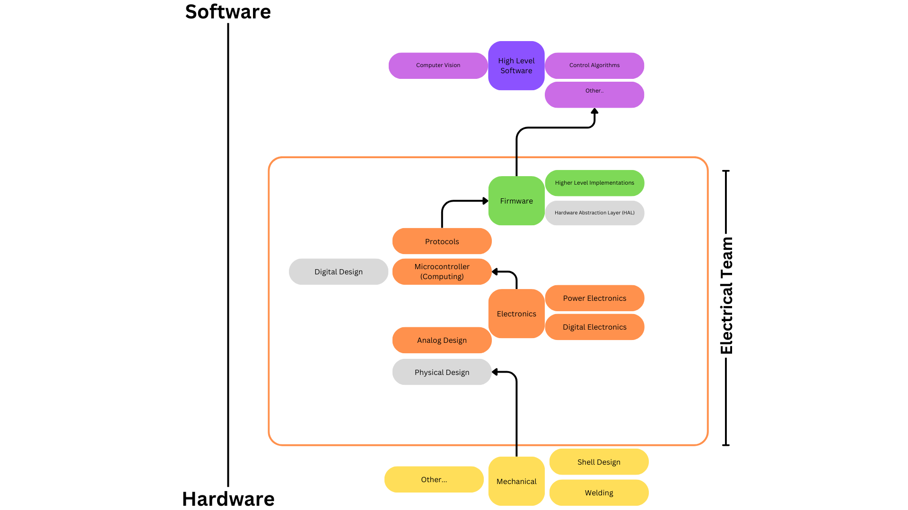
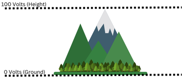
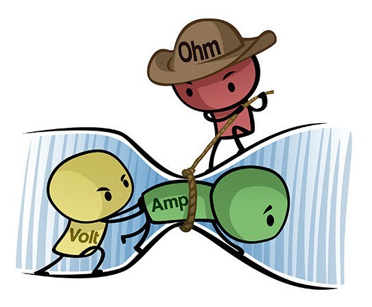
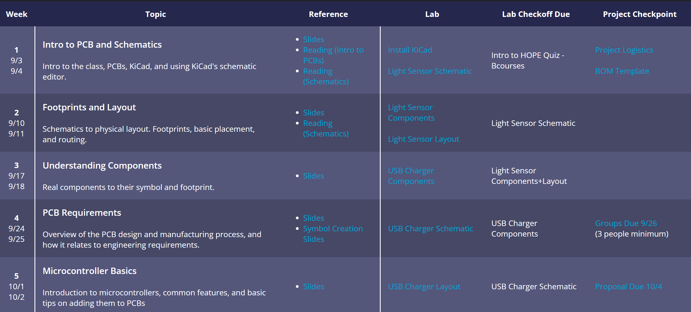

# Underwater Robotics @ Berkeley | Electrical Training

Hello there! Welcome to UR@B electrical team! UR@B Electrical training will introduce you to basic circuit concepts, and firmware. Additionally, the HOPE Decal content created by IEEE @ Berkeley will introduce you to printed circuit board CAD tools. 

> "*Note: Feel free too ask/wait for a electrical team member to help you when working on this training to prevent frustration.*"

> "*Note: If you already feel comfortable with all the concepts below, feel free to skip this whole training all together and work on the project*"

### Prerequisites:
- None

At the end of the training, you will know: 

1. Basic Circuit (Electronic) Concepts
2. Basic Printed Circuit Board Design (PCB) CAD Tools 

### High Level View:

    

In the electrical team, you will be creating the electronics and the associated software to make it work. 

 

> "*Note: For each part, click on the dropdown to show the content.*"

# Prelab: Electronics (Hardware) - Part 1

You will learn about the concept of ground, voltage, current and various machine tools used in electrical engineering. 

Electronics Dropdown

## Current
Current is the rate at which electrons (particles) flow. Remember that particles are physical in nature. 

## Voltage 
Particles will stay still unless there is enough pressure to get them moving. Voltage is the difference in electric potential energy between two points. 
It is the **"Push"** that gives pressure to push electrons (particles) through a circuit. 

## Reference Voltage (Ground) 

    

Reference voltage commonly referred to as **ground** is a value that can be used with respect to everything else. 
One example is that "Earth ground" can be used as the reference voltage but most times the reference voltage is relative to the application. 

 

**"Common" ground** is the reference voltage that is shared across
the whole application. 

> **V_GND = 0 V**

Most times, zero volts are used as the reference voltage to make calculations easier.  

Note that the reference voltage may not necessarily be 0 volts, It can be any value as long as the circuit designer is consistent. 

## Resistance
Resistance is the opposition to the flow of current. Everything has resistance including wires itself. 

## Ohm Law

    

Image Credits: Build-electronics-circuit / Oyvind Nydal Dahl

 

Bringing it all together with Ohm's Law.  

> Voltage = Current * Resistance
 
> Current = Voltage / Resistance

> Resistance = Voltage / Current 

## Hardware Equipment
> Note: Please ask if you are interested in getting hands on experience with these machines.

### Power Supply Unit
Power supply unit provide a voltage source. 

### Multimeter
Measures Voltage, Current, and Resistance.

### Oscilloscope
Mainly used for tracking "signals". Signals are just voltage values. Oscilloscope is a multimeter but is able to provide a graph of the signal over time. 

> Checkpoint: No Checkpoint for Part 1

# Datasheet - Part 2 
When you are making anything, you are often not creating everything from scratch. You will need to use technical manuals, reference sheets, datasheets to know various features of "devices" that you plan on using in a design.

For example, consider a LED. 

There is a voltage value that the LED must be used to get the LED to turn on. This voltage value is called the "forward voltage". 
Consider: https://learn.adafruit.com/all-about-leds/the-led-datasheet
If you look at the datasheet, you will find that the "forward voltage" is 1.85V. That means the voltage difference across the LED should be that voltage value.

Note: Classes, Search engines, and books are your best friend in figuring out what various attributes you need to know when designing. 

Naturally, you are effectively required to search for information on your own because no one knows the exact information that is required.

Additionally, to make the LED work, you need to add a resistor. The point of the resistor is to limit the current. `R = 150Ohm - 300 Ohm` will work. The resistance depends on how intense the LED you want and minimum LED values.

# PCB ECAD Tools - KICAD - Part 3

Instead of using prototyping boards like stripboards and breadboards, you will now create a "PCB" which makes your electronics much more versatile. Instead of wires failing off, the wires can't fall off printed circuit boards. Like how 3D Printing design uses CAD tools like Solidworks, electrical engineers use electronic computer aided design (ECAD) like KiCad. 

PCB ECAD Tools Dropdown

To get used to the KiCad ECAD software, please follow the HOPE course. 
#### Hands on PCB Engineering (HOPE) | IEEE @ Berkeley
IEEE @ Berkeley has created a awesome decal (course) on printed circuit board design. All content and credits goes to staff at the Hope Decal

See HOPE Decal- https://ieee.berkeley.edu/hope/
If the link does not work, please search for: IEEE Berkeley HOPE Decal
 

<h1>Disclaimer: We use "Altium Designer" </h1>
<b>But doing the training in KiCad is much easier. Altium is just another
ECAD tool but it isn't that intuitive to use. </b>

 

**For underwater robotics, Please do the following content and associated labs:**
1. Install Kicad
2. Light Sensor Schematic
3. Light Sensor Components
4. Light Sensor Layout
5. USB Charger Components (Optional)
6. USB Charger Schematic (Optional)
7. USB Charger Layout (Optional)

    

> Checkpoint: The DRC for both schematic/layout should show no errors. DRC - Design Rule Checker.

# Design
We did not at all cover the "Design" aspect of electrical engineering, searching for answers through your coursework, using search engines, and asking questions are the best way to learn "Design". 

Here are some keywords that outlines the steps to make a design work:
1. Planning
2. Tapeout
3. Bringup
4. Implementation

# Notes
The training and project is not meant to be comprehensive. Hopefully the training and project is good enough as a launchpad for you to further investigate engineering.

# Other:

