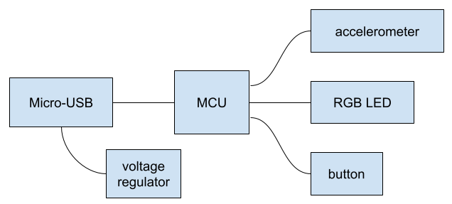
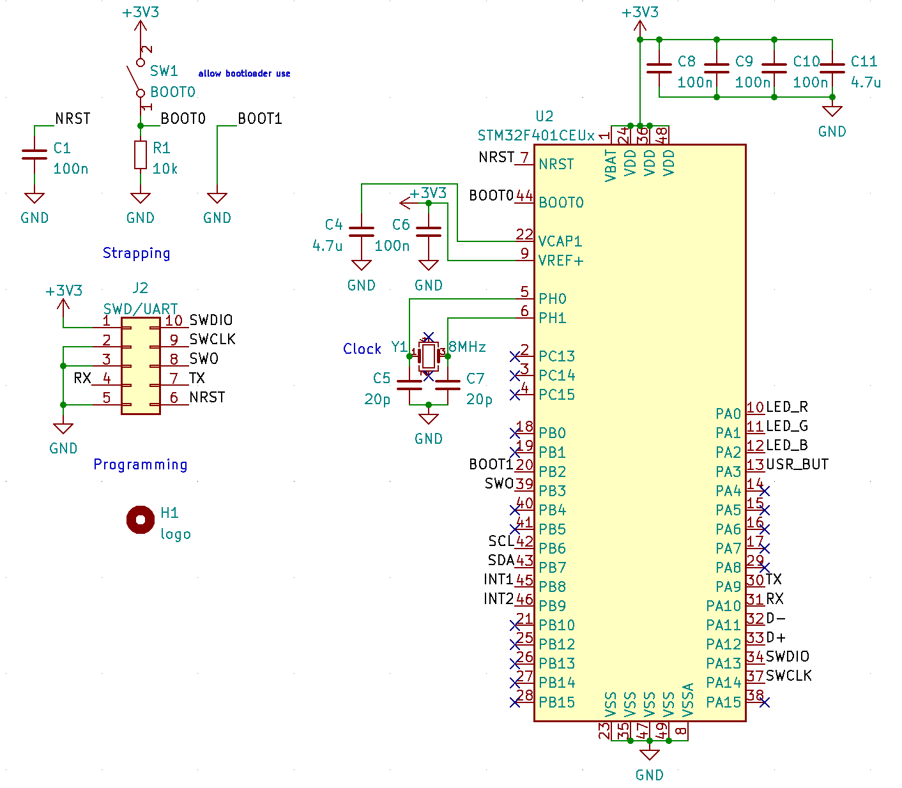

# Reference Solution

One important thing to note is that the engineering process is not always a straightforward path. Often times, issues - some of which are out of our control - may pop up in later steps that cause us to go back to the drawing board to address them. For example, requirements may change, parts may become unavailable, or during layout it becomes impossible to meet a certain physical form factor.

Every section here is worth an entire discussion all on its own. In the interest of time and acknowledging that there are far better resources out there, we'll keep things brief. Electrical engineering is a huge field but don't be afraid to dive down the occasional rabbit hole. As always, *ask questions*.

## Block Diagram

With the project requirements set, we can start with a high-level block diagram that illustrates the major building blocks in our solution. The main thing to consider is how the blocks would work together to meet the requirements and how to turn them into circuit-level pieces in the next step.

    

The above block diagram implements a very typical architecture for solving problems which is to have a main CPU running some firmware that talks to peripheral sensors and actuate some effectors. In our case, the microcontroller (MCU) will run code that takes in readings from an accelerometer to measure the gravity vector, giving us the angle. The button allows the user to set a target angle and the LED provides an indicator for meeting the target. Power comes in through the USB port.

## Part Selection

Ultimately, choosing parts boils down to balancing various desirable traits to turn the block diagram into an actual design. It's important to make sure the parts are compatible with each other in things like voltage and communication protocols. I typically start by pulling ideas from other designs or past experience. Beyond that, I like to search using major electronics distributors like Digikey as well as going directly to a manufacturer's website. Parts manufacturers typically also provide customer service to further aid in the parts search.

For this solution, the focus was on a fast turnaround time and using already purchased parts. To achieve that, I compromised on things like cost, size, and power draw. We'll use the STM32F401CEU6 as the microcontroller, the LSM6DSM as the accelerometer, and the MIC5365 as the regulator. For passive parts like resistors and capacitors, I typically leave the exact part choice until the very end since there's usually many alternates.

In many cases, an additional factor I consider is the availability of schematic symbols and footprints. While parts that have those available are generally more expensive, not having to make those myself can usually save enough time to make it worth it for small quantities and fast turnaround.

## Schematic

For our team, we use KiCad since it's open-source and surprisingly powerful. Other software to be aware of particularly in industry are Autodesk EAGLE, Altium Designer, and Cadence Allegro.

Every board design starts with a schematic symbolically detailing which components are to be used and how they are connected. For most of the designs we do, it really boils down to taking each part and looking at its datasheet, reference designs, and/or reference manual to figure out what components are needed to make the part work in the larger design. Manufacturers typically also provide engineering support.

Since this architecture is so common, let's take a look at the things one would consider when turning each block into a circuit.

### Power

Every time I start a project, I always like to ask how is the device powered? It's important to consider the voltage and current ranges as well as the noise coming in. Are there any safety concerns or desired behavior in extreme conditions? Based on what all of the other parts need, these things will determine how exactly all of the different components in your device are to be powered.

In our case, we're going to keep things simple. It'll be USB powered only. Looking at the rest of the parts, they'll all work on 3.3V which is pretty standard. None of the parts draw very much power or have special noise requirements. An LDO to drop the voltage from 5V to 3.3V will work just fine and has a really simple circuit.

    

### Microcontroller

For most microcontrollers and even microprocessors and FPGAs, getting them working boils down to completing the following sections.

- **Power** - what voltages and currents does it need? how about power sequencing? any internal supplies need external capacitors?
- **Strapping** - a.k.a. boot or bootstrapping, are there any pins that need to be configured to get the desired behavior such as booting from flash?
- **Clocks** - are there any required input clocks or is the common internal oscillator adequate? is there a required accuracy?
- **Programming** - how will the device be programmed? via SWD/JTAG or a bootloader?
- **Peripherals** - is there anything special that needs to be added to communicate with the other devices such as voltage translation or transceivers?

    

For the STM32F401CEU6, it just needs 3.3V with a couple of decoupling capacitors. It's also got an internal regulator that needs external decoupling on `VCAP1`. For strapping, `BOOT0` and `BOOT1` control the boot mode which we default to GND for each to boot from flash. It's not necessary, but we also use `SW1` to boot from the internal ROM instead for an alternate code upload method. Most chips also have a `NRST` reset pin which needs to be pulled to `VDD` (ours has an internal pullup resistor) and decoupled. While in most cases the internal RC oscillator is fine, for USB communications a more accurate clock is needed so we add an external crystal. For programming, we'll use the standard SWD port and add UART for easier debugging. For peripherals, we need to make sure that the peripheral we want to use is available on the physical pin we choose.

### Accelerometer

Getting most peripheral chips working involves the exact same steps as getting a microcontroller working. In fact, most of the time the datasheet includes a complete circuit that you can just copy in to your design.

    

### ERC

Once the schematic is done, it's always a good idea to run the ERC (Electrical Rule Check) which does basic checking that there's no major mistakes. For KiCad, it doesn't do much more than check that pins are compatible with each other as defined. Most of the times it'll catch things that aren't errors, but it's better to err on the side of caution.

## Layout

Now that the schematic is done, it's time to convert it to a physical design. In most cases, this will involve a PCB (printed circuit board) or combination of interconnected PCBs. Often times, we'll work with mechanical team to determine a form factor we can both work with.

### DFM

The most important factor to consider is DFM (design for manufacture) because at the end of the day we have to make the design. Manufacturability directly impacts things like cost, lead times, and potential vendors. For PCBs, fab houses will always provide a list of their capabilities that you can use when performing layout. It's actually possible to push these limits, but success isn't guaranteed. Here's a list of the specs I like to look at first when considering a fab house.

- Copper weight
- Number of layers
- Minimum trace width/space
- Minimum drill size
- Minimum annular ring width
- Minimum hole to hole spacing

### Actual Layout

At times, doing the actual layout can feel like an art. You're literally placing components in their physical locations and drawing wires between them. There's auto-routers out there, but they don't usually work as well as humans so they're more of an aid than a solution.

When drawing the traces, the width is usually the main consideration as it needs to be wide enough to handle the current flowing. There's calculators for this. Keeping noisy traces away from sensitive signals is also a good idea. Avoiding loops (trees are better!) is also good since they can pick up noise easier. Trace and component spacing usually doesn't matter until we reach high voltages (>50V). Adding a copper pour (filling all available spaces with copper) connected to `GND` is usually good as it provides a bit of shielding and a low impedance path ensuring all components have a stable reference.

For more complex designs like with RF or high frequency communication, a good layout becomes significantly more important. At that point, we need to consider tranmission line effects so have to take the board stackup and electrical permittivity into account. Adjusting the length of traces and even skew of differential pairs becomes important. For high power designs, managing thermals can become difficult and good heatsinking becomes important. Thankfully, we won't need to deal with those limits (unless you want to!).

Layout is one of those things that can sound daunting, but once you do it a couple times it isn't that bad.

    
    

The main issue with the above layout is the liberal use of via-in-pad. Vias electrically connect multiple layers in a PCB and are physically just electroplated holes. Via-in-pad is bad because the holes can suck away solder that would've went into securing a component, resulting in a bad connection. Since we're only making low quantities and can touch up boards afterwards, it isn't a large issue for our board. Of course, there are also expensive processes to mitigate this issue that might be a good idea when scaling up a design.

### DRC

Before sending a design off to the fab house, it's always a good idea to run the DRC (design rule check) which checks that all of the clearances and distances are within the defined specs. Generally speaking we want to end up with a DRC without errors.

If we run the DRC on the reference solution, we'll see that the LSM6DSM's footprint violates DRC because there isn't enough clearance between pads. I'd recommend modifying the footprint to meet clearance at the cost of a less reliable mount. In this case, I wanted to experiment a bit and see what would happen if I sent in a design that violated minimum clearances. At worst it'd probably be manually adjusted or overetched to a larger clearance.

## Manufacturing

Once the layout is done, it's time to generate the files that we can send to the fab house for manufacture. The industry standard format is Gerber. Most fab houses provide a guide on how to export your design into a format that they like.

There are services to perform PCB assembly but for the quantities and complexity we do they tend to not be worth it. There are two main solder techniques for manual assembly (which are closely related to automated assembly). Hand soldering involves taking a soldering iron with a hot metal tip or hot air and manually securing components. Reflow soldering has us applying solder paste to the board, placing components, and then sending the whole thing through an oven to melt the solder. Many guides exist on soldering techniques.

## Firmware

TODO

## Test!

TODO
